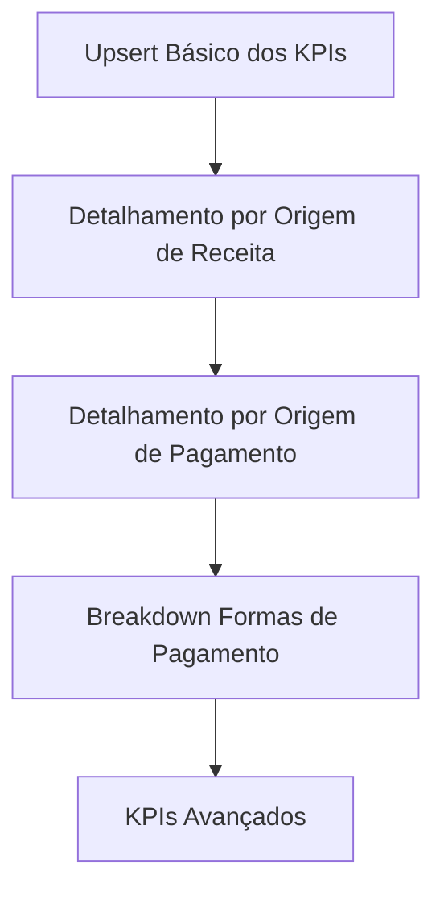

# iFood Sales Concierge – Arquitetura & Guia de Workflows (n8n + WhatsApp + MCP)

Este projeto automatiza a análise financeira semanal de restaurantes integrados ao iFood, usando WhatsApp como canal principal de interação. Toda a orquestração é feita via n8n, centralizada por um workflow MCP (Master Control Process), que distribui as tarefas para workflows específicos conforme a jornada do usuário.

## Visão Geral dos Workflows

1. **MCP – Orquestrador Central:** Recebe todas as mensagens/arquivos do WhatsApp, identifica o contexto e o estado do usuário, e roteia para o workflow correto.
2. **Onboarding e Autenticação:** Gerencia o primeiro contato, cadastro do usuário e autenticação via WhatsApp.
3. **Cadastro de Cartão e Ativação do Trial:** Solicita e registra cartão, libera 7 dias grátis e gerencia status de trial/cobrança.
4. **Processamento da Planilha de Segunda-feira:** Recebe/processa `relatorio_financeiro`, gera super resumo, previsão de repasse e insights da semana.
5. **Processamento da Planilha de Quarta-feira (Conciliação):** Recebe/processa `relatorio_conciliacao`, realiza conciliação e gera insights.
6. **Insights Diários Agendados:** Envia insights diários automaticamente, baseados na planilha de segunda-feira.
7. **Comandos Simples/FAQ:** Responde a comandos como “oi”, “ajuda”, “saldo”, etc.
8. **Gerenciamento de Usuários/Estado:** Salva e consulta o estado do usuário (onboarding, trial, planilhas recebidas, etc).
9. **Cobrança e Pagamentos:** Gerencia cobrança após trial, suspende serviço se necessário.

## Sequência Recomendada de Criação dos Fluxos

1. MCP Orquestrador Central
2. Gerenciamento de Usuários/Estado
3. Onboarding e Autenticação
4. Cadastro de Cartão e Ativação do Trial
5. Processamento da Planilha de Segunda-feira
6. Processamento da Planilha de Quarta-feira
7. Insights Diários Agendados
8. Comandos Simples/FAQ
9. Cobrança e Pagamentos

## Requisitos Técnicos

- Python 3.10+
- Supabase (URL e chave service_role)
- n8n para orquestração
- Variáveis de ambiente configuradas em `.env` na raiz do projeto:

```env
SUPABASE_URL=https://xxxx.supabase.co
SUPABASE_KEY=eyJhbGciOiJIUzI1...
```

## Formato das Planilhas Esperadas

- **relatorio_financeiro (segunda-feira):**
  - ID DO PEDIDO
  - N° PEDIDO
  - DATA
  - RESTAURANTE
  - ID DO RESTAURANTE
  - TAXA DE ENTREGA
  - VALOR DOS ITENS
  - INCENTIVO PROMOCIONAL DO IFOOD
  - INCENTIVO PROMOCIONAL DA LOJA

- **relatorio_conciliacao (quarta-feira):**
  - (Definir colunas esperadas conforme padrão do iFood)

## Recomendações

- Centralize o recebimento das mensagens no MCP.
- Cada workflow deve ser modular e independente.
- Documente cada workflow no próprio n8n (descrição do nó inicial).
- Use variáveis de ambiente para tokens, chaves e URLs sensíveis.
- Salve o estado do usuário de forma consistente para garantir continuidade.

## Como Contribuir

1. Siga a sequência lógica de criação dos fluxos.
2. Sempre registre alterações relevantes neste README.
3. Teste os fluxos de ponta a ponta simulando diferentes jornadas de usuário.

---

## Requisitos

- Python 3.10+
- Supabase (URL e chave service_role)
- n8n para orquestração
- Variáveis de ambiente configuradas em `.env` na raiz do projeto:

```
SUPABASE_URL=https://xxxx.supabase.co
SUPABASE_KEY=eyJhbGciOiJIUzI1...
```

## Formato da Planilha Esperada

A planilha deve conter **exatamente** as seguintes colunas (nomes idênticos):

- ID DO PEDIDO
- N° PEDIDO
- DATA
- RESTAURANTE
- ID DO RESTAURANTE
- TAXA DE ENTREGA
- VALOR DOS ITENS
- INCENTIVO PROMOCIONAL DO IFOOD
- INCENTIVO PROMOCIONAL DA LOJA
- TAXA DE SERVIÇO
- TOTAL DO PARCEIRO
- TOTAL DO PEDIDO
- FORMAS DE PAGAMENTO

Outras colunas são ignoradas, mas estas são obrigatórias para o processamento correto.

## Execução Manual do Script

```bash
.venv/bin/python3 scripts/process_report.py \
  --file-path "/caminho/para/arquivo.xlsx" \
  --account-id "<UUID da conta>" \
  --file-id "<UUID do registro na tabela received_files>"
```

## Dicas de Troubleshooting

- **Erro de política de segurança/RLS:** Verifique se a chave SUPABASE_KEY é a `service_role` copiada corretamente do painel do Supabase.
- **Erro de coluna não encontrada:** Confirme que os títulos das colunas na planilha estão idênticos aos listados acima.
- **Arquivo não aparece no bucket:** Verifique logs do script e permissões do bucket no Supabase.

## Próximos Passos Sugeridos

- Implementar notificações automáticas de sucesso/erro via WhatsApp.
- Permitir múltiplos formatos de planilha (ex: CSV).
- Dashboard web para consulta de KPIs históricos.
- Permissões avançadas por usuário.

---

Para dúvidas ou para sugerir melhorias, abra uma issue ou entre em contato com o mantenedor do projeto.


## 📊 Pipeline de KPIs Diários — Documentação Técnica

### Objetivo
Calcular e atualizar os KPIs diários por loja, data e conta, detalhando vendas, estornos e ocorrências avulsas, agrupando corretamente por tipo de evento e data relevante.

### Lógica Validada
- **Pedidos/estornos:** agrupados por `data_do_pedido_ocorrencia`.
- **Ocorrências avulsas:** agrupadas por `pedido_id_completo` (que armazena a data nesses casos).
- **Classificação:**
  - "Recebido via iFood" ou "Recebido via Loja": pedidos normais.
  - "Estorno": quando `tipo_de_faturamento` contém "estorno".
  - "Ocorrência Avulsa": quando `tipo_de_faturamento` contém "ocorrência avulsa".
  - "Ocorrência": outros casos em que `origem_de_forma_de_pagamento` é NULL.

### Exemplo de SQL para Atualização dos KPIs

```sql
WITH base AS (
    SELECT
        account_id,
        loja_id AS store_id,
        CASE
            WHEN tipo_de_faturamento ILIKE '%ocorrência avulsa%' THEN pedido_id_completo::date
            ELSE data_do_pedido_ocorrencia::date
        END AS kpi_date,
        CASE
            WHEN tipo_de_faturamento ILIKE '%estorno%' THEN 'Estorno'
            WHEN tipo_de_faturamento ILIKE '%ocorrência avulsa%' THEN 'Ocorrência Avulsa'
            WHEN origem_de_forma_de_pagamento IS NULL THEN 'Ocorrência'
            ELSE origem_de_forma_de_pagamento
        END AS origem_pagamento_kpi,
        valor_liquido
    FROM public.sales_data
    WHERE received_file_id = '[ID_DO_ARQUIVO]'
      AND (
        (tipo_de_faturamento ILIKE '%ocorrência avulsa%' AND pedido_id_completo IS NOT NULL)
        OR (tipo_de_faturamento NOT ILIKE '%ocorrência avulsa%' AND data_do_pedido_ocorrencia IS NOT NULL)
      )
),
agregada AS (
    SELECT
        account_id,
        store_id,
        kpi_date,
        origem_pagamento_kpi,
        SUM(COALESCE(valor_liquido, 0)) AS total_sales,
        COUNT(*) AS total_orders
    FROM base
    GROUP BY account_id, store_id, kpi_date, origem_pagamento_kpi
),
json_kpi AS (
    SELECT
        account_id,
        kpi_date,
        store_id,
        jsonb_object_agg(
            origem_pagamento_kpi,
            jsonb_build_object(
                'total_sales', total_sales,
                'total_orders', total_orders
            )
        ) AS sales_by_payment_origin
    FROM agregada
    GROUP BY account_id, kpi_date, store_id
)
UPDATE public.daily_kpis AS k
SET sales_by_payment_origin = j.sales_by_payment_origin,
    updated_at = now()
FROM json_kpi j
WHERE k.account_id = j.account_id
  AND k.kpi_date = j.kpi_date
  AND k.store_id = j.store_id;
```

### Observações
- Sempre agrupe por data correta para cada tipo de evento.
- Separe ocorrências avulsas dos pedidos normais.
- Use JSONB para detalhamento flexível e fácil expansão.
- Atualize apenas os KPIs necessários, evitando sobrescrever dados válidos de outros dias/lojas.


## 💳 Breakdown de Formas de Pagamento por Origem

Este SQL gera e atualiza o campo `payment_methods_breakdown` na tabela `daily_kpis`, estruturando o resultado em JSON aninhado por origem de recebimento (iFood/Loja) e por forma de pagamento (crédito, débito, dinheiro, etc.):

```sql
WITH base AS (
    SELECT
        account_id,
        loja_id AS store_id,
        data_do_pedido_ocorrencia::date AS kpi_date,
        CASE
            WHEN origem_de_forma_de_pagamento = 'Recebido via iFood' THEN 'Recebido via iFood'
            WHEN origem_de_forma_de_pagamento = 'Recebido via Loja' THEN 'Recebido via Loja'
            ELSE 'Outro'
        END AS origem_recebimento,
        formas_de_pagamento,
        valor_liquido
    FROM public.sales_data
    WHERE received_file_id = '[ID_DO_ARQUIVO]'
      AND origem_de_forma_de_pagamento IN ('Recebido via iFood', 'Recebido via Loja')
      AND data_do_pedido_ocorrencia IS NOT NULL
),
agregada AS (
    SELECT
        account_id,
        store_id,
        kpi_date,
        origem_recebimento,
        formas_de_pagamento,
        SUM(COALESCE(valor_liquido, 0)) AS total_sales,
        COUNT(*) AS total_orders
    FROM base
    GROUP BY account_id, store_id, kpi_date, origem_recebimento, formas_de_pagamento
),
json_by_origin AS (
    SELECT
        account_id,
        store_id,
        kpi_date,
        origem_recebimento,
        jsonb_object_agg(
            formas_de_pagamento,
            jsonb_build_object(
                'total_sales', total_sales,
                'total_orders', total_orders
            )
        ) AS payment_methods
    FROM agregada
    GROUP BY account_id, store_id, kpi_date, origem_recebimento
),
final_json AS (
    SELECT
        account_id,
        store_id,
        kpi_date,
        jsonb_object_agg(
            origem_recebimento,
            payment_methods
        ) AS payment_methods_breakdown
    FROM json_by_origin
    GROUP BY account_id, store_id, kpi_date
)
UPDATE public.daily_kpis AS k
SET payment_methods_breakdown = f.payment_methods_breakdown,
    updated_at = now()
FROM final_json f
WHERE k.account_id = f.account_id
  AND k.kpi_date = f.kpi_date
  AND k.store_id = f.store_id;
```

**Exemplo de saída no campo `payment_methods_breakdown`:**

```json
{
  "Recebido via iFood": {
    "Crédito": {"total_sales": 1234.56, "total_orders": 10},
    "Débito": {"total_sales": 789.01, "total_orders": 5}
  },
  "Recebido via Loja": {
    "Dinheiro": {"total_sales": 50.00, "total_orders": 1}
  }
}
```

- O JSON permite análises detalhadas por canal e por forma de pagamento.
- O update é incremental, não afeta outros campos já existentes.

---

## 📦 KPIs Avançados: Entregas grátis, Comissões e Taxas

Estes campos foram adicionados para enriquecer a análise dos KPIs diários:

- **free_deliveries_count:** quantidade de pedidos com entrega grátis (`taxa_de_entrega = 0`)
- **total_commission_and_fees:** soma de comissão iFood, taxa de transação e taxa de entrega iFood
- **total_ifood_delivery_fees:** soma apenas da taxa de entrega cobrada pelo iFood
- **commission_percentage:** percentual de comissão e taxas sobre o valor bruto (`base_de_calculo`)

### SQL de UPDATE dos KPIs Avançados

```sql
WITH novos_kpis AS (
    SELECT
        data_do_pedido_ocorrencia::date AS kpi_date,
        loja_id AS store_id,
        COUNT(*) FILTER (WHERE taxa_de_entrega = 0) AS free_deliveries_count,
        SUM(
            COALESCE(valor_comissao_ifood, 0) +
            COALESCE(comissao_pela_transacao_do_pagamento, 0) +
            COALESCE(solicitacao_servicos_entrega_ifood, 0)
        ) AS total_commission_and_fees,
        SUM(COALESCE(solicitacao_servicos_entrega_ifood, 0)) AS total_ifood_delivery_fees,
        SUM(COALESCE(valor_liquido, 0)) AS total_sales,
        CASE 
            WHEN SUM(COALESCE(base_de_calculo, 0)) > 0 
            THEN ROUND(
                SUM(
                    COALESCE(valor_comissao_ifood, 0) +
                    COALESCE(comissao_pela_transacao_do_pagamento, 0) +
                    COALESCE(solicitacao_servicos_entrega_ifood, 0)
                ) / SUM(COALESCE(base_de_calculo, 0)) * 100, 2
            )
            ELSE NULL
        END AS commission_percentage
    FROM public.sales_data
    WHERE received_file_id = '[ID_DO_ARQUIVO]'
      AND data_do_pedido_ocorrencia IS NOT NULL
    GROUP BY data_do_pedido_ocorrencia::date, loja_id
)
UPDATE public.daily_kpis AS k
SET
    free_deliveries_count = n.free_deliveries_count,
    total_commission_and_fees = n.total_commission_and_fees,
    total_ifood_delivery_fees = n.total_ifood_delivery_fees,
    total_sales = n.total_sales,
    commission_percentage = n.commission_percentage,
    updated_at = now()
FROM novos_kpis n
WHERE k.kpi_date = n.kpi_date
  AND k.store_id = n.store_id;
```

---

## ⚡ Arquitetura de Triggers/Funções para KPIs Diários

### Visão Geral
O pipeline de KPIs é dividido em etapas independentes, cada uma implementada como uma função SQL e um trigger separado. Cada trigger roda automaticamente sempre que a tabela `sales_data` recebe um novo registro (INSERT ou UPDATE).

### Ordem Recomendada de Execução

1. **Upsert Básico dos KPIs**
   - Cria/atualiza os totais principais por loja/data, incluindo o cálculo do Ticket Médio (campo `average_ticket`), que corresponde à soma de `total_do_pedido` dividida pelo número de pedidos do dia.
2. **Detalhamento por Origem de Receita**
   - Atualiza o campo `sales_by_revenue_type`.
3. **Detalhamento por Origem de Pagamento**
   - Atualiza o campo `sales_by_payment_origin`.
4. **Breakdown por Forma de Pagamento**
   - Atualiza o campo `payment_methods_breakdown`.
5. **KPIs Avançados (Comissões, Taxas, Entregas grátis)**
   - Atualiza: `free_deliveries_count`, `total_commission_and_fees`, `total_ifood_delivery_fees`, `commission_percentage`.

### Papel e Regra de Cada Trigger

- **Triggers são independentes:** Cada função pode ser atualizada, testada e executada isoladamente.
- **Execução automática:** Sempre que houver alteração em `sales_data`, todas as funções são disparadas, garantindo que os KPIs estejam sempre atualizados.
- **Facilidade de manutenção:** Novos KPIs podem ser adicionados criando novas funções/triggers sem afetar os demais.
- **Ordem lógica:** Recomenda-se manter a ordem acima para garantir que os campos de detalhamento sejam calculados sobre dados já existentes.
- **Performance:** Triggers são do tipo `FOR EACH STATEMENT` para evitar múltiplas execuções desnecessárias em operações em lote.

### Exemplo de Orquestração



### Observações
- Evite que funções atualizem a tabela `sales_data` para não criar loops de triggers.
- Para manutenção, basta alterar a função desejada sem impactar as outras.
- Triggers podem ser ativadas/desativadas individualmente para debug ou manutenção.

---

## 🏁 Primeiro SQL de Agrupamento e População dos KPIs

Este SQL foi utilizado para popular inicialmente a tabela `daily_kpis` com os totais principais por loja e data, antes do detalhamento por origem de pagamento:

```sql
INSERT INTO public.daily_kpis (
    account_id,
    kpi_date,
    store_id,
    store_name,
    total_sales,
    total_orders,
    total_ifood_promo,
    total_store_promo
)
SELECT
    account_id,
    data_do_pedido_ocorrencia::date AS kpi_date,
    loja_id AS store_id,
    nome_da_loja AS store_name,
    SUM(COALESCE(valor_liquido, 0)) AS total_sales,
    COUNT(*) AS total_orders,
    SUM(COALESCE(promocao_custeada_pelo_ifood, 0)) AS total_ifood_promo,
    SUM(COALESCE(promocao_custeada_pela_loja, 0)) AS total_store_promo
FROM public.sales_data
WHERE received_file_id = '[ID_DO_ARQUIVO]'
  AND data_do_pedido_ocorrencia IS NOT NULL
GROUP BY
    account_id, data_do_pedido_ocorrencia::date, loja_id, nome_da_loja
ON CONFLICT (account_id, kpi_date, store_id)
DO UPDATE SET
    total_sales = EXCLUDED.total_sales,
    total_orders = EXCLUDED.total_orders,
    total_ifood_promo = EXCLUDED.total_ifood_promo,
    total_store_promo = EXCLUDED.total_store_promo,
    updated_at = now();
```

- Esse bloco garante a inserção/atualização dos KPIs principais antes do detalhamento avançado.
- Os campos de detalhamento (JSONB) podem ser atualizados em etapas posteriores, conforme mostrado acima.

---

## 📈 Atualização dos KPIs Semanais

#### Novo cálculo correto do percentual de comissão (commission_percentage)

O campo `commission_percentage` semanal **deve ser calculado como:**

```
commission_percentage = SUM(total_commission_and_fees) / SUM(base_de_calculo) * 100
```

Ou seja, o denominador deve ser a soma de `base_de_calculo` (vindo da tabela `sales_data`) e não o total de vendas.

#### Uso de CTE para performance e precisão

Para realizar esse cálculo corretamente e de forma eficiente, utilize uma CTE (Common Table Expression) para pré-agregar o valor de `base_de_calculo` por semana, loja e conta. Veja exemplo:

```sql
WITH base_calc AS (
    SELECT
        s.account_id,
        s.loja_id AS store_id,
        (EXTRACT(YEAR FROM s.data_do_pedido_ocorrencia)::int * 100) + EXTRACT(WEEK FROM s.data_do_pedido_ocorrencia)::int AS week_year,
        SUM(COALESCE(s.base_de_calculo, 0)) AS sum_base_de_calculo
    FROM public.sales_data s
    WHERE s.account_id = '<ACCOUNT_ID>'
      AND s.data_do_pedido_ocorrencia IS NOT NULL
    GROUP BY s.account_id, s.loja_id, week_year
)
INSERT INTO public.weekly_kpis (
    account_id,
    store_id,
    store_name,
    week_year,
    week_number,
    year,
    total_sales,
    total_orders,
    total_ifood_promo,
    total_store_promo,
    total_commission_and_fees,
    total_ifood_delivery_fees,
    free_deliveries_count,
    commission_percentage,
    average_ticket,
    created_at,
    updated_at
)
SELECT
    d.account_id,
    d.store_id,
    MAX(d.store_name) AS store_name,
    (EXTRACT(YEAR FROM d.kpi_date)::int * 100) + EXTRACT(WEEK FROM d.kpi_date)::int AS week_year,
    EXTRACT(WEEK FROM d.kpi_date)::int AS week_number,
    EXTRACT(YEAR FROM d.kpi_date)::int AS year,
    SUM(COALESCE(d.total_sales, 0)) AS total_sales,
    SUM(COALESCE(d.total_orders, 0)) AS total_orders,
    SUM(COALESCE(d.total_ifood_promo, 0)) AS total_ifood_promo,
    SUM(COALESCE(d.total_store_promo, 0)) AS total_store_promo,
    SUM(COALESCE(d.total_commission_and_fees, 0)) AS total_commission_and_fees,
    SUM(COALESCE(d.total_ifood_delivery_fees, 0)) AS total_ifood_delivery_fees,
    SUM(COALESCE(d.free_deliveries_count, 0)) AS free_deliveries_count,
    CASE 
        WHEN bc.sum_base_de_calculo > 0
        THEN ROUND(SUM(COALESCE(d.total_commission_and_fees, 0)) / bc.sum_base_de_calculo * 100, 2)
        ELSE NULL
    END AS commission_percentage,
    CASE 
        WHEN SUM(COALESCE(d.total_orders, 0)) > 0
        THEN ROUND(SUM(COALESCE(d.average_ticket, 0) * COALESCE(d.total_orders, 0)) / SUM(COALESCE(d.total_orders, 0)), 2)
        ELSE NULL
    END AS average_ticket,
    now() AS created_at,
    now() AS updated_at
FROM public.daily_kpis d
JOIN base_calc bc
  ON d.account_id = bc.account_id
  AND d.store_id = bc.store_id
  AND (EXTRACT(YEAR FROM d.kpi_date)::int * 100) + EXTRACT(WEEK FROM d.kpi_date)::int = bc.week_year
WHERE d.account_id = '<ACCOUNT_ID>'
GROUP BY
    d.account_id,
    d.store_id,
    (EXTRACT(YEAR FROM d.kpi_date)::int * 100) + EXTRACT(WEEK FROM d.kpi_date)::int,
    EXTRACT(WEEK FROM d.kpi_date)::int,
    EXTRACT(YEAR FROM d.kpi_date)::int,
    bc.sum_base_de_calculo
ON CONFLICT (account_id, store_id, week_year)
DO UPDATE SET
    store_name = EXCLUDED.store_name,
    total_sales = EXCLUDED.total_sales,
    total_orders = EXCLUDED.total_orders,
    total_ifood_promo = EXCLUDED.total_ifood_promo,
    total_store_promo = EXCLUDED.total_store_promo,
    total_commission_and_fees = EXCLUDED.total_commission_and_fees,
    total_ifood_delivery_fees = EXCLUDED.total_ifood_delivery_fees,
    free_deliveries_count = EXCLUDED.free_deliveries_count,
    commission_percentage = EXCLUDED.commission_percentage,
    average_ticket = EXCLUDED.average_ticket,
    updated_at = now();
```

#### Ajuste do tipo de store_id

Se seus dados históricos usam store_id numérico/texto (e não UUID), altere o tipo da coluna na tabela weekly_kpis para `varchar(255)` para garantir compatibilidade.

```sql
ALTER TABLE public.weekly_kpis ALTER COLUMN store_id TYPE varchar(255);
```

#### Triggers automáticos para weekly_kpis

Para garantir que os próximos dados já sejam agregados semanalmente de forma automática, crie um trigger semelhante ao dos KPIs diários, mas disparando a função de upsert/agregação semanal sempre que houver INSERT ou UPDATE relevante nas tabelas de origem (`sales_data` ou `daily_kpis`).

Checklist:
- [x] Função de upsert semanal criada
- [x] Trigger semanal criada e ativa
- [x] Testes realizados com novos dados

Assim, toda nova carga de dados será refletida automaticamente na tabela weekly_kpis.

---

Se precisar do SQL do trigger semanal, peça que gero para você!
